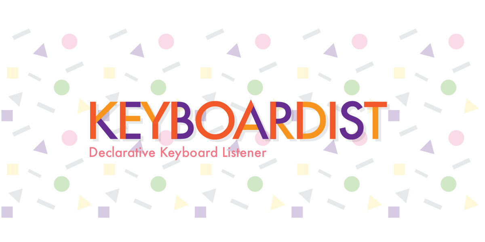

# Keyboardist



An declarative way to add keyboard shortcuts to your browser applications.

For using with React, there's
[React Keyboardist](https://github.com/soska/react-keyboardist).

Example:

```javascript
// by default it listens to keydown
const listener = Keyboardist();

listener.subscribe('down', () => {
  console.log('Pressed down');
});

listener.subscribe('shift+down', () => {
  console.log('Pressed Shift + down');
});
```

## Install

Example:

```
$ npm install keyboardist
```

## Usage

the `Keyboardist` returns a listener object that has only one method:
`suscribe`.

`suscribe` accepts two arguments: a key or key combination and a method that
will be called when that key (or key combination) is triggered by the user.

Example:

```javascript
import Keyboardist from 'keyboardist';

const listener = new Keyboardist();

const keySubscription = keyboard.subscribe('/', () => {
  focusSearch();
});
```

The object returned by `suscribe` has an `unsuscribe` method.

```javascript
// create a subscription
const keySubscription = keyboard.subscribe('/', () => {
  focusSearch();
});

// remove the subscription
keySubscription.unsuscribe();
```

## Other events

By default, the listener listens to `keydown` events, but you can pass `keyup`
as an argument to `Keyboardist` to use that event instead

```javascript
const downListener = Keyboardist();
const upListener = Keyboardist('keyup');

downListener.subscribe('a', () => {
  console.log('Just pressed the A key');
});

upListener.subscribe('a', () => {
  console.log('Just released the A key');
});
```
